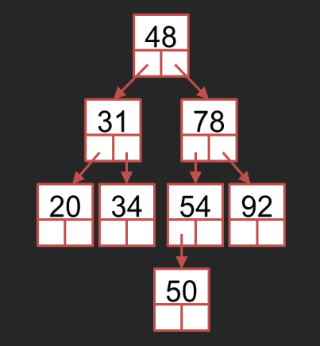

# Binary Search Trees 🌳

## 📝 Instructions

1. **Download Lab Instructions**: Download Binary Trees Lab instructions from the portal.
2. **Create Project**: Create a new NetBeans project.
3. **Add Classes**: Add the two Java classes (`BSTree` and `BSTNode`) to the project.
4. **Modify Insert Method**: Modify the insert method so that it displays the nodes visited before insertion of a node.
5. **Create the Following Tree**: Create the following tree. You will need to create a separate class with a main method.

6. **Perform Traversals**: Do the following traversals while printing out the contents of the nodes:
    - a. **Preorder**
    - b. **Postorder**
    - c. **Inorder**

7. **Implement Methods**: Implement the methods we discussed in class for searching a value, finding the maximum, and finding the minimum within the provided class. The maximum and minimum values should then be printed from the test class. The success or failure of the search method should be indicated from the test class.

8. **Implement Iterative Traversals**: Implement iterative preorder, postorder, and inorder traversal within the provided class. Test them and print out the tree contents.

9. **Explain Recursive Search**: Explain the working of the recursive method of searching a value in a binary tree. Illustrate using the tree created in this lab. Write down the method calls and their return values. Assume searching for the value 50.

10. **Explain Recursive Delete**: Explain the working of the recursive method for deleting a node in a binary tree. Illustrate using the tree created in this lab. Write down the method calls and their return values. Assume deleting the node with the value 34.

### Explanations

#### Recursive Search

The recursive method compares the target value with the current node's data. If the target value is smaller, the method is called recursively on the left subtree; if larger, on the right subtree. If the value matches the current node's data, the search is successful.

When searching for the value `50` in the given tree:

1. We start at root `31`.
2. Then move to the right child `48` (50 > 31).
3. Then move to the right child `78` (50 > 48).
4. Then move to the left child `54` (50 < 78).
5. Then move to the left child `50` (50 < 54).
6. `50` is found.

#### Recursive Delete

The recursive method locates the node to be deleted. If the node has no children, it is simply removed. If it has one child, that child replaces the node. If it has two children, the node's data is replaced with the smallest data from its right subtree, and that smallest node is then deleted.

For example, deleting the node with value `34` in the given tree:

1. We Start at root `31`.
2. The move to the right child `48` (34 > 31).
3. Then move to the left child `34` (34 < 48).
4. Node `34` found. It has no children, so it is simply removed.
5. Node `34` deleted.

## Solution Files
   - [BSMain](BSMain.java)
   - [BSTNode](BSTNode.java)
   - [BSTree](BSTree.java)